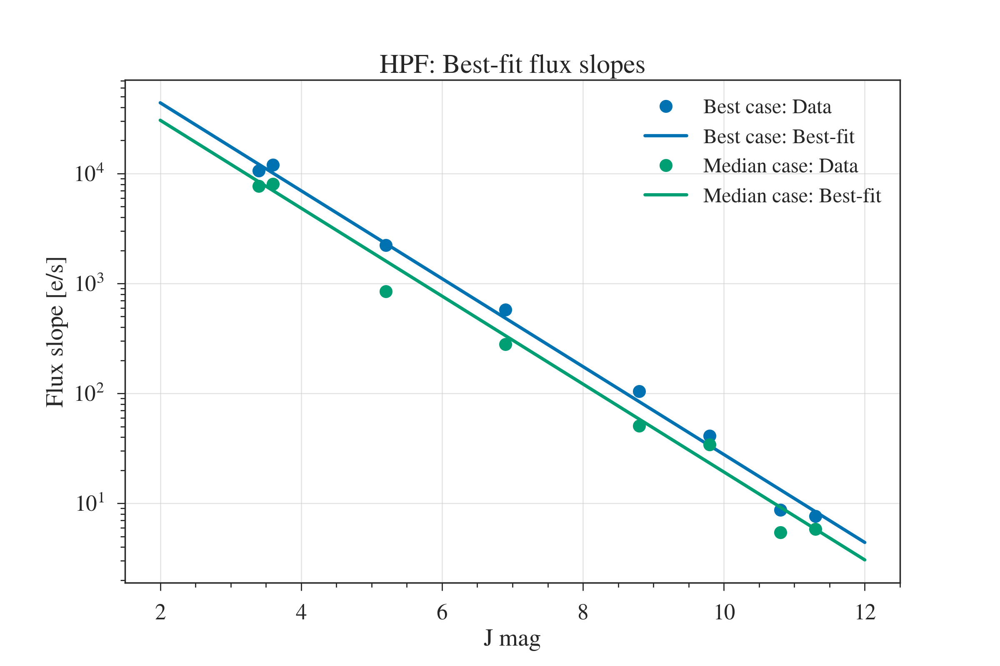
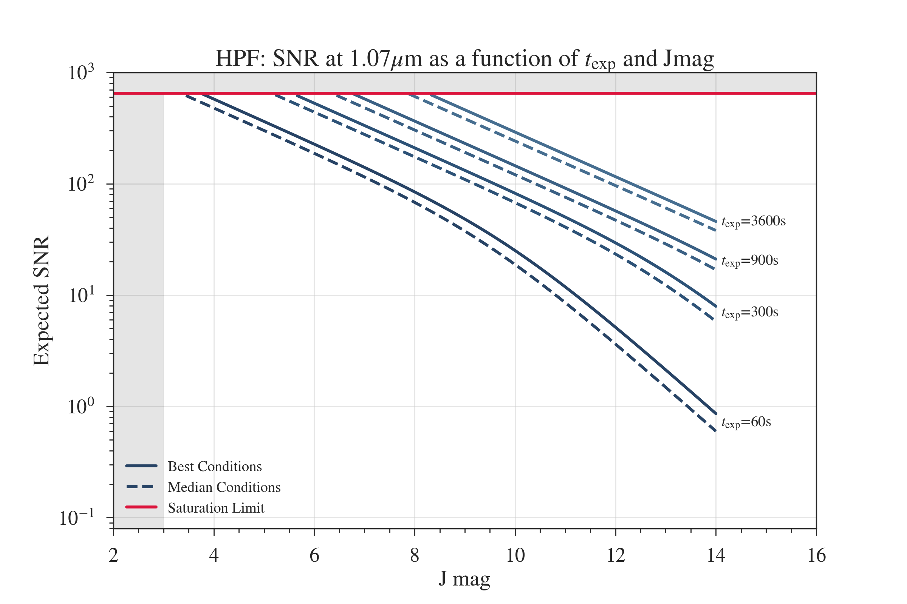
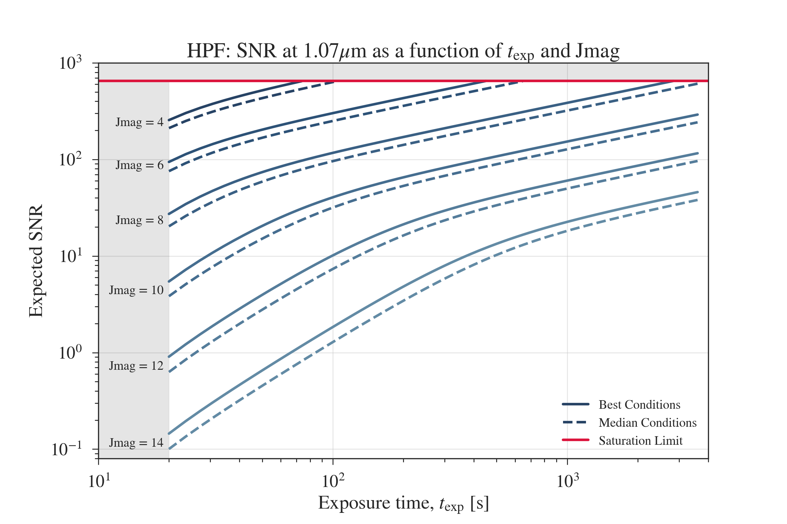

# HPF-SNR-plots
Python scripts describing HPF SNR calculations.

Provides code to produce the plots below.

These SNR calculations from M. Robberto's JWST Technical Report: <a href='https://jwst.stsci.edu/files/live/sites/jwst/files/home/instrumentation/technical%20documents/JWST-STScI-002161.pdf'>Two Fundamental Equations for IR Ramp Fitting</a> to include readoutnoise errors.

Take a look at the ipython notebooks for the code ! 

A further discussion of HPF exposure times and Phase IIs can be found here: <a href='https://psuastro.github.io/HPF/Exposure-Times/'>https://psuastro.github.io/HPF/Exposure-Times/</a>

Plots:

